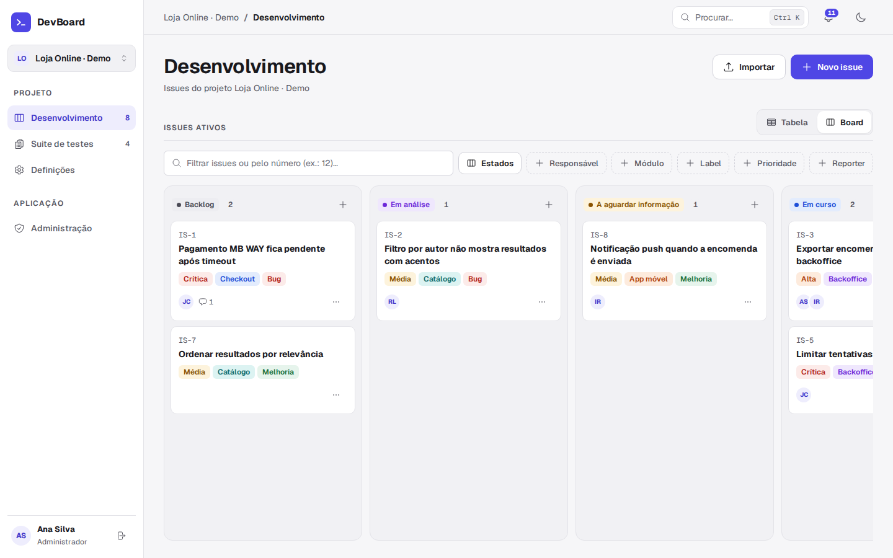
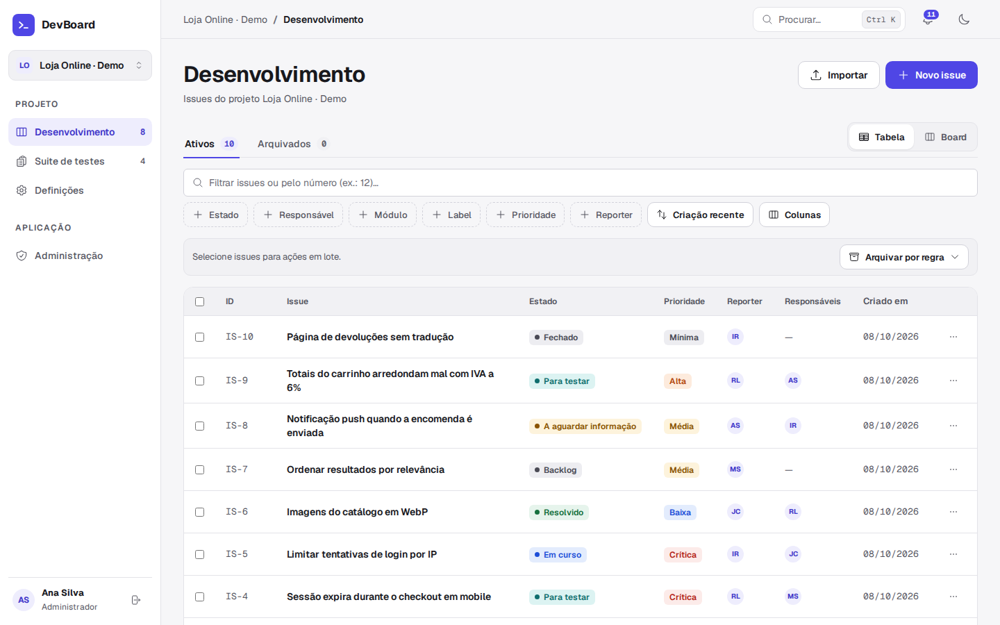
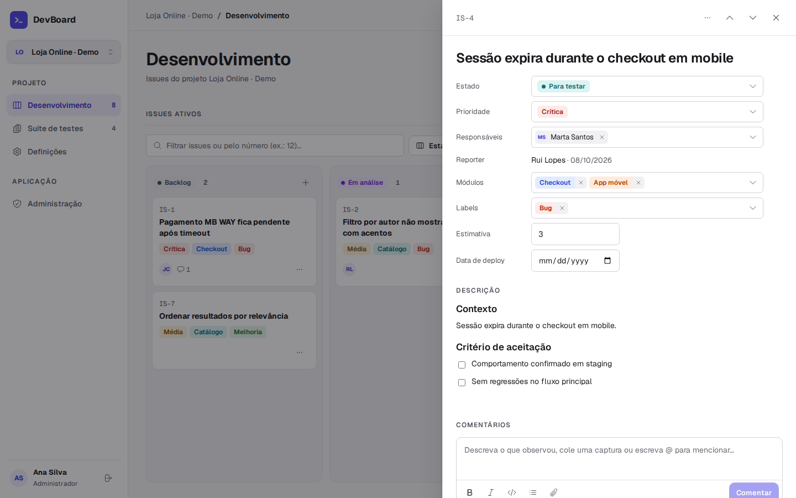
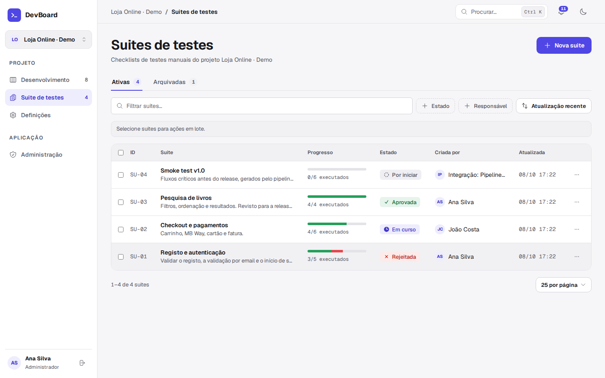
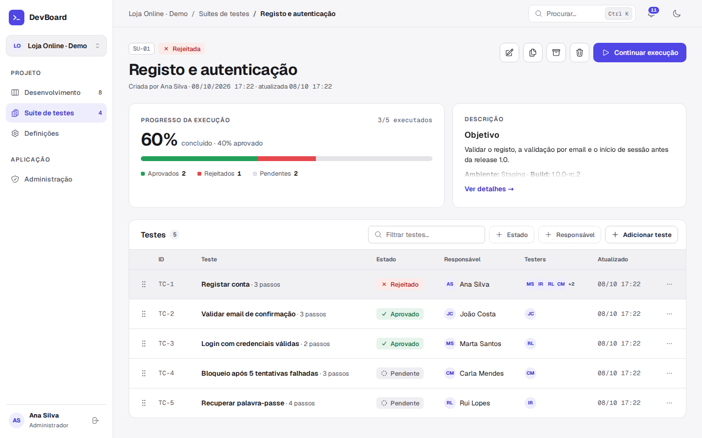
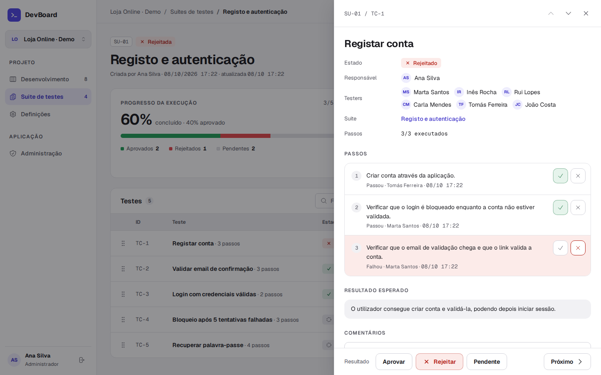
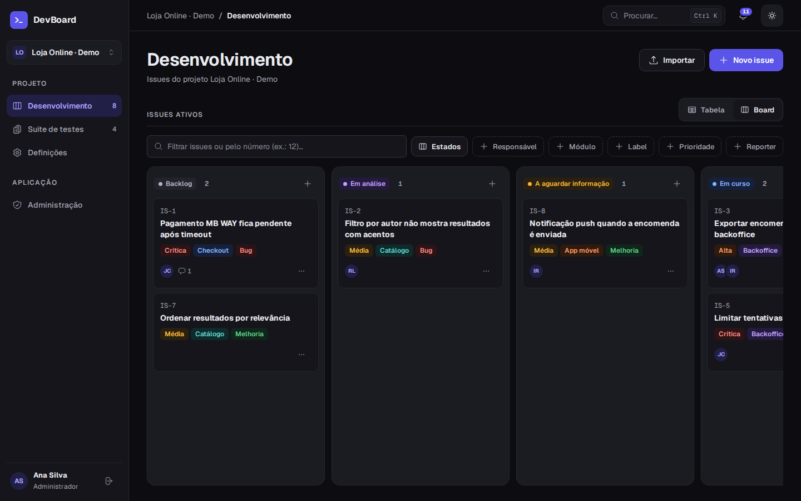
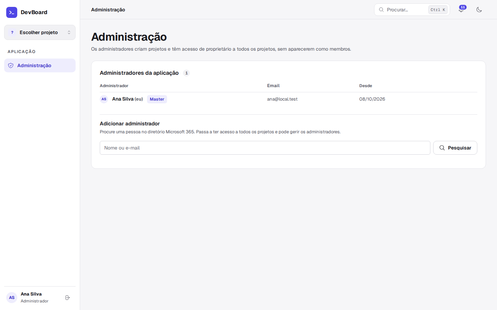

# DevBoard

**Testes manuais e gestão de issues para equipas de produto, dentro do Microsoft Teams.**

O DevBoard junta num só sítio as duas metades do ciclo de entrega: o que a equipa de desenvolvimento tem para fazer e a validação manual antes de cada release. Cada projeto tem uma área de **Desenvolvimento**, com issues em tabela ou board, e uma área de **Suites de testes**, com checklists de testes manuais em que a equipa regista resultados passo a passo. Funciona como tab do Microsoft Teams (com sessão Microsoft Entra e notificações no feed de Atividade) ou, para desenvolvimento, num browser com utilizadores locais.



## Destaques

- **Issues em tabela ou board**: estados, módulos e labels configuráveis por projeto, prioridade, estimativa, responsáveis múltiplos e reporter imutável. No board arrasta-se cartões entre estados, e cada pessoa escolhe e reordena as colunas que vê.
- **Suites de testes manuais**: cada teste tem passos, resultado esperado e resultado (Aprovado, Rejeitado com motivo obrigatório, ou Pendente). O progresso e o estado da suite são calculados a partir dos testes.
- **Colaboração**: comentários em Markdown (editor TipTap), @menções, anexos e capturas coladas com Ctrl+V, histórico completo de cada item e centro de notificações, também entregue no feed do Teams.
- **Ações em lote**: arquivar, restaurar ou apagar vários issues ou suites de uma vez, e arquivar por regra (por exemplo todos os issues em «Duplicado»).
- **Importação de folhas de cálculo**: `.xlsx`/`.csv` com associação assistida de colunas, pessoas, estados e módulos, transacional e sem notificações.
- **Publicação por IA ou CI**: uma API com chaves por projeto permite que um pipeline ou um agente de IA crie suites de testes pendentes a partir de uma release.
- **Acesso**: administradores da aplicação (com setup inicial protegido por código), proprietários, membros e leitores por projeto, bloqueios temporários e verificação de permissões no servidor em cada pedido.
- **Pesquisa global** (Ctrl+K), temas claro, escuro e alto contraste, interface em português de Portugal e layout responsivo.

## Capturas de ecrã

| | |
| --- | --- |
|  |  |
| **Issues em tabela**, com filtros, colunas por utilizador e ações em lote | **Painel do issue**, com edição direta, módulos, labels e comentários |
|  |  |
| **Suites de testes**, com progresso e estado calculados | **Detalhe da suite**, com testes, responsáveis e testers |
|  |  |
| **Execução de um teste**, passo a passo, com resultado e motivo | **Modo escuro** (também segue o tema do Teams) |
|  | |
| **Administração**: administradores da aplicação e o master | |

As imagens usam o projeto de demonstração criado por `npm run seed:demo`, com pessoas e dados fictícios.

## Tecnologia

React 19 e Fluent UI v9 no frontend, Express e PostgreSQL no servidor, TypeScript em todo o código. Autenticação com Microsoft Entra (tokens verificados no servidor) ou, em desenvolvimento, com utilizadores locais. Testes com `node:test` e PGlite (PostgreSQL embutido), Playwright para o browser e um cenário end-to-end com PostgreSQL em Docker.

## Início rápido (local, sem Microsoft 365)

Requer Node.js 22+ e Docker.

```bash
cp .env.example .env          # defina AUTH_MODE=local e, se quiser, TESTHUB_SETUP_CODE
npm install
npm run db:up                 # PostgreSQL 16 em Docker
npm run db:migrate
npm run dev                   # http://localhost:3978/tabs/home/
```

Entre como um dos utilizadores locais e conclua o setup inicial com o código de `TESTHUB_SETUP_CODE` (ou o que o servidor mostra no log). Quem conclui o setup fica administrador master. Para ter dados de exemplo, corra `npm run seed:demo` com o servidor a correr.

Para a integração com o Teams e o Microsoft Entra, veja [Microsoft Entra e Teams](#microsoft-entra-e-teams).

> O produto chamava-se TestHub. A mudança de nome é só visual: os identificadores técnicos mantêm-se (base de dados e volume Docker `testhub`, variáveis `TESTHUB_*`, prefixo `th_` das chaves, chaves `testhub.*` no browser) para não perder dados nem partir integrações. Numa app Teams já criada, o nome no Developer Portal muda-se à mão; o manifesto (versão 1.2.0) já usa «DevBoard». O ícone (um prompt de terminal `>_`) é gerado a partir de SVG por `npm run icons:render`, que escreve `appPackage/color.png` (192 × 192), `appPackage/outline.png` (32 × 32, branco sobre transparente) e `public/favicon.svg`.

## Funcionalidades em detalhe

- Qualquer membro do projeto pode registar resultados. Aprovar e repor pendente são ações diretas; **Rejeitado** exige um motivo, guardado atomicamente com o resultado e a identidade do autor.
- Estado da suite calculado pelos testes: qualquer rejeitado → Rejeitado; todos aprovados → Aprovado; caso contrário → Pendente.
- Progresso = testes com resultado / total. Uma suite 100% revista pode conter rejeições. Suites vazias ficam pendentes.
- Alterar instruções/resultado esperado repõe pendente. Reabrir mantém o histórico.
- Cada teste pode ter uma **prioridade** (Crítica, Alta, Média, Baixa ou Mínima, a mesma escala dos issues), mostrada na coluna antes do Estado e editada no formulário do teste. Alterar a prioridade fica no histórico mas não repõe o resultado. A migração `012_test_priority.sql` acrescenta a coluna.
- Duplicar cria uma suite independente pendente, sem copiar resultados ou discussões.
- Proprietários arquivam suites, consultam **Arquivadas** e restauram sem perder resultados, responsáveis ou comentários. Arquivadas são apenas de leitura. Proprietários e administradores selecionam várias suites para as arquivar, restaurar ou apagar de uma vez, numa só transação.
- Projetos podem ter uma imagem até 48 × 48 px e ser apagados por um proprietário. A eliminação é lógica: o projeto desaparece e deixa de aceitar acessos, mantendo os dados na base para retenção segura.
- Descrições, instruções, resultados esperados e comentários são editados e apresentados com TipTap, mantendo Markdown no contrato e na base de dados. A barra de formatação inclui títulos, listas, checklists, citações, código e tabelas.
- A lista e a página da suite apresentam o progresso numa barra segmentada (verde aprovado, vermelho rejeitado, neutro pendente) com a contagem "x/y executados". Os estados têm significado fixo e aparecem sempre com ícone e texto; a suite mostra "Em curso" ou "Por iniciar" enquanto estiver pendente, conforme já tenha ou não resultados.
- Suites e testes têm números estáveis guardados na base: `SU-xx` por projeto e `TC-n` por suite, atribuídos na criação. Reordenar não muda o número; duplicar cria uma suite com novo `SU` e mantém os `TC` da original.
- Cada teste tem **passos** estruturados, com resultado partilhado pela equipa (por executar, passou, falhou), autor e data. Os passos são editados no formulário do teste; alterar passos, instruções ou resultado esperado repõe o teste e os passos para pendente. O resultado dos passos é informativo e não decide o resultado do teste. Ao publicar sem `steps`, a primeira lista das instruções passa a ser os passos (a migração `005_test_steps.sql` aplicou a mesma regra aos testes existentes e guardou o texto original em `legacy_instructions`).
- **Testers**: quem registou um resultado, comentou ou marcou um passo num teste. A tabela mostra até 4 avatares sobrepostos e o painel do teste a lista completa.
- Comentários e motivos de rejeição aceitam **@menções** de membros do projeto (validadas no servidor) e **anexos**: imagens PNG/JPEG/GIF/WebP, PDF, TXT/LOG, CSV e JSON até 10 MB, guardados no PostgreSQL. Uma captura colada com Ctrl+V é anexada automaticamente. O tipo é decidido pela extensão e confirmado pelo conteúdo; os anexos só são descarregados através da API por membros do projeto, e os ainda não publicados são privados de quem os enviou.
- **Centro de notificações** (sino no cabeçalho), gravadas na mesma transação da atividade e nunca enviadas a quem fez a ação: resultados, comentários, alterações e eliminação de um teste para o responsável e os testers desse teste; menções para os mencionados; atribuições para o novo responsável; novas suites e suites apagadas para todos os membros; edição da suite, testes adicionados e arquivo/restauro para os testers e responsáveis da suite. Reordenar não notifica. Cada notificação abre o teste e destaca o comentário; as de itens apagados abrem o local mais próximo que ainda existe. No Teams, as mesmas notificações chegam também ao feed de Atividade (ver «Notificações no feed de atividade do Teams»).
- **Apagar suites e testes**: os proprietários apagam suites e testes, e o responsável de um teste pode apagar esse teste, sempre com confirmação. A eliminação é lógica, como nos projetos: o item desaparece das listas, contagens e pesquisa, mas resultados, comentários, anexos e histórico ficam guardados; os números `SU`/`TC` não são reutilizados.
- **Pesquisa global** (Ctrl+K): suites, testes (incluindo passos), issues e comentários de todos os projetos a que o utilizador tem acesso; aceita também `SU-04`, `TC-2` ou `IS-7`.
- A tabela de testes permite pesquisar, filtrar por um ou vários estados e por responsável, paginar em grupos de 10 e reordenar por drag-and-drop; as ações de mover continuam disponíveis no menu para teclado e dispositivos sem drag.
- A atividade e os comentários pertencem ao respetivo teste e surgem apenas no seu painel, depois das instruções, do resultado esperado e das ações de resultado. A timeline apresenta comentários em cartões.
- A descrição, os formulários e as confirmações abrem em painéis laterais à direita, com altura total e cabeçalho fixo. O compositor apresenta diretamente a caixa TipTap e ações compactas, sem rótulos ou notas redundantes.
- O tema segue o Teams (incluindo alto contraste) ou o sistema por predefinição; o botão no cabeçalho alterna claro/escuro e a escolha fica guardada no navegador, aplicada antes da primeira pintura por `public/theme-init.js`. As cores, raios e espaçamentos são tokens semânticos em `src/Tab/tokens.css`; a interface usa Geist e Geist Mono alojadas localmente. Responsáveis mostram a fotografia do diretório quando disponível e iniciais como fallback.
- API para o seu fluxo de IA publicar JSON com Markdown, com chaves por projeto e retries seguros.

### Administração e setup inicial

- Antes de qualquer outra coisa, a app pede o **setup inicial**: a primeira pessoa com sessão iniciada que introduz o **código de setup** fica **administrador master**. Até lá, a API só responde a `GET /me` e `POST /setup` (as restantes rotas devolvem 409). O código vem de `TESTHUB_SETUP_CODE`; se a variável não existir, o servidor gera um código ao arrancar e mostra-o no seu log (`DevBoard: setup inicial pendente. Código de setup: …`) quando alguém abre a app. O setup só acontece uma vez.
- **Administradores da aplicação** (página **Administração** na barra lateral): criam projetos, veem e entram em todos os projetos com poderes de proprietário, e adicionam ou removem administradores a partir do diretório. Não aparecem como membros dos projetos, não recebem notificações e não podem ser responsáveis; para isso adicionam-se ao projeto como membros. Um projeto novo começa sem membros e abre nas Definições para adicionar a equipa. O acesso de administrador prevalece sobre o papel de leitor ou um bloqueio. A pesquisa global de um administrador abrange todos os projetos.
- O **master** não pode ser removido. Remover um administrador fica registado (`removed_at`/`removed_by`) e a pessoa pode voltar a ser administradora. A migração `011_app_admins.sql` acrescenta a tabela `app_admins`; numa instalação existente, os proprietários mantêm os seus projetos, mas só os administradores criam projetos novos.

### Membros e acesso

- Definições → Geral mostra os membros numa tabela com pesquisa por nome ou email e filtro por papel (Proprietários, Membros, Leitores, Bloqueados). O botão **Papéis e permissões** abre uma tabela que compara o que o leitor, o membro, o proprietário e o administrador podem fazer.
- Papéis: **Proprietário**, **Membro** e **Leitor** (só leitura). O leitor consulta suites, testes e issues, mas não edita, não comenta, não regista resultados e não pode ser responsável; ao tornar alguém leitor, as atribuições em testes e issues ativos são removidas e ficam no histórico. A regra é aplicada no servidor (qualquer escrita devolve 403).
- **Bloqueio temporário** (proprietários, nunca a si próprios nem a outro proprietário): o membro deixa de ver o projeto, as notificações e os resultados de pesquisa desse projeto até ser desbloqueado ou até à data escolhida. Papel, dados e atribuições mantêm-se. A migração `010_member_access.sql` acrescenta o papel e os campos do bloqueio.

### Desenvolvimento (issues)

- Cada issue tem número estável `IS-n` por projeto, título, descrição Markdown, estado, prioridade (P1 Crítica a P5 Mínima), estimativa, data de criação/reporte, data de deploy, módulos e labels (vários de cada), um **reporter** e vários **responsáveis**.
- O reporter é sempre quem criou o issue (no servidor, a partir da identidade verificada) e não pode ser alterado. Qualquer membro atribui responsáveis ou atribui-se a si próprio com «Atribuir-me».
- **Estados, módulos e labels** configuram-se em Definições → Desenvolvimento (proprietários): nome, cor da paleta e ordem; os estados têm categoria «Por fazer», «Em progresso» ou «Concluído», e o projeto mantém sempre um estado por fazer e um concluído. Os projetos novos (e os existentes, pela migração `009_issues.sql`) começam com Backlog, Em análise, A aguardar informação, Em curso, Para testar, Resolvido, Fechado e Duplicado. Apagar um estado com issues obriga a escolher para onde os mover.
- **Tabela** com pesquisa, filtros (um ou vários estados, incluindo «em aberto», combinados com «ou»; responsável incluindo «Os meus» e «Sem responsável», módulo, label, prioridade, reporter), ordenação, paginação de 25, separadores Ativos/Arquivados e colunas escolhidas por cada utilizador (por defeito ID, Issue, Estado, Prioridade, Reporter, Responsáveis, Criado em e Ações). A vista e as colunas ficam guardadas por utilizador no servidor.
- **Board** com uma coluna por estado: arrastar entre colunas muda o estado e dentro da coluna reordena; no menu de cada cartão há «Mover para…» e mover para cima/baixo para teclado. Cada pessoa escolhe no menu **Estados** que colunas vê (fica sempre pelo menos uma) e reordena-as arrastando o cabeçalho da coluna ou com Alt+← / Alt+→ no nome do estado; «Repor ordem e estados» volta à ordem do projeto. A disposição é guardada no servidor por pessoa e por projeto (`issues.board.<projectId>`) e não altera a configuração dos estados; estados novos aparecem no fim.
- Painel lateral com edição direta dos campos, comentários com @menções e anexos e histórico (mudanças de estado, atribuições e campos alterados).
- Duplicar (cópia no estado inicial, reporter = quem duplica, sem comentários), arquivar/restaurar (proprietários) e apagar logicamente (proprietários ou o reporter). Arquivados são só de leitura.
- Um membro só apaga os issues de que é reporter; proprietários e administradores apagam qualquer issue.
- **Ações em lote** (proprietários e administradores, vista Tabela): caixas de seleção por linha e por página. Em Ativos, «Arquivar selecionados» e «Apagar selecionados»; em Arquivados, «Restaurar selecionados» e «Apagar selecionados». «Arquivar por regra» arquiva todos os issues ativos de um estado concluído (ex.: «Duplicado», «Resolvido») ou de todos os concluídos, indicando o número afetado antes de confirmar; o histórico de cada issue indica a regra usada. Cada ação corre numa só transação e é recusada por inteiro se algum item tiver sido alterado entretanto.
- Notificações: atribuição para quem foi atribuído por outra pessoa; comentários para reporter, responsáveis e quem já comentou; menções; mudança de estado e eliminação para reporter e responsáveis. Também chegam ao feed do Teams (tipos `issueAssigned` e `issueChanged`).
- **Importar** (proprietários) de `.xlsx` ou `.csv`: o ficheiro é lido no browser e um assistente associa colunas, pessoas, estados, módulos e tipos/labels ao projeto, com sugestões automáticas (ignora maiúsculas e acentos; `irocha` ↔ Inês Rocha). A coluna de submódulos (ex.: «Sub-módulo») também cria módulos: uma linha `frontend` / `Carrinho` fica com os módulos Frontend e Carrinho. As colunas de observações entram como comentários de quem importa. Linhas com uma referência já importada são ignoradas. A importação é transacional, segura em repetições (Idempotency-Key) e **não envia notificações**.

Não executa testes automaticamente nem chama um fornecedor de IA. Não cria recursos cloud ou publica a aplicação por si.

## Pré-requisitos

Para desenvolvimento local: Node.js 22+ e Docker com Docker Compose. O PostgreSQL do projeto é fornecido por [compose.yaml](compose.yaml) e a autenticação local não requer uma conta Microsoft.

A integração final no Teams requer um tenant Microsoft 365, uma aplicação Microsoft Entra configurada, Microsoft 365 Agents Toolkit e permissão para instalar aplicações no tenant. O servidor precisa então de acesso HTTPS ao Entra e ao Microsoft Graph.

## Ambiente e base de dados

Copie os campos de [.env.example](.env.example) para um ficheiro local `.env` e preencha:

| Variável                       | Utilização                                                     |
| ------------------------------ | -------------------------------------------------------------- |
| `AUTH_MODE`                    | `local` para browser local; `microsoft` por predefinição       |
| `TESTHUB_SETUP_CODE`           | Código do setup inicial; sem ele, é gerado e mostrado no log   |
| `DATABASE_URL`                 | Ligação PostgreSQL; TLS conforme os requisitos do seu servidor |
| `ENTRA_TENANT_ID`              | Tenant de recursos onde colegas e convidados participam        |
| `ENTRA_CLIENT_ID`              | ID da aplicação Entra                                          |
| `ENTRA_RESOURCE_URI`           | URI exata da API exposta, igual ao recurso do manifesto Teams  |
| `ENTRA_CLIENT_SECRET`          | Segredo apenas do servidor, necessário para Graph OBO          |
| `SSL_CRT_FILE`, `SSL_KEY_FILE` | Certificados HTTPS locais confiáveis                           |
| `PORT`                         | 3978 por predefinição                                          |

### PostgreSQL local com Docker

O repositório inclui [compose.yaml](compose.yaml) para desenvolvimento local. O ficheiro `.env` é partilhado pela aplicação e pelo Docker Compose e permanece fora do controlo de versões.

```bash
# Inicia PostgreSQL e espera pelo healthcheck.
npm run db:up

# Aplica apenas as migrações ainda não registadas.
npm run db:migrate

# Consulta o estado do contentor.
npm run db:status

# Verifica a aplicação e inicia o ambiente de desenvolvimento.
npm run check
npm run dev
```

A base do projeto fica disponível apenas em `127.0.0.1:5432` por predefinição e os dados persistem no volume Docker `testhub_testhub-postgres-data`. O contentor reinicia automaticamente, exceto depois de ser parado explicitamente. `npm run db:down` para o contentor sem remover o volume. Para outra porta ou credenciais, altere `POSTGRES_*` e mantenha `DATABASE_URL` sincronizada. Estas credenciais destinam-se exclusivamente à máquina local.

Não use `sslmode=disable` numa ligação remota que exige TLS. Para CA privada, configure o trust store/SSL do ambiente de execução. Não desative a validação de certificados. Não coloque segredos no frontend ou no controlo de versões.

```bash
npm install
npm run db:migrate
npm run build
npm start
```

As migrações usam transação, lock e uma tabela `schema_migrations`. Escolha explicitamente a base antes de executar; não são aplicadas automaticamente ao iniciar o servidor. O utilizador de migrações precisa de criar tabelas/índices. Configure depois um utilizador de runtime com as permissões necessárias sobre as tabelas.

### Autenticação local

Defina `AUTH_MODE=local` apenas no `.env` ignorado e execute `npm run dev`. Abra `http://localhost:3978/tabs/home/` quando não usar certificados. A página permite iniciar sessão como Ana, João, Marta, Rui ou Inês, ou como Carla e Tomás, que têm email externo para simular convidados do Teams; estas identidades são definidas pelo servidor e usam sessões bearer aleatórias com duração máxima de 12 horas. Pode mudar de utilizador para validar permissões, atribuição e histórico. A pesquisa de membros usa o mesmo diretório local. Para usar outras pessoas, defina no `.env` `TESTHUB_LOCAL_USERS` com uma lista JSON (`[{"name":"…","email":"…"}]`): substitui as identidades predefinidas e o `oid` de cada pessoa é derivado do email, pelo que se mantém entre reinícios. O `seed:demo` precisa das identidades predefinidas.

O modo local está desativado por predefinição. O servidor recusa arrancar com `AUTH_MODE=local` quando `NODE_ENV=production`; o App Service e o fluxo Agents Toolkit forçam `AUTH_MODE=microsoft`. As sessões locais residem apenas em memória e são invalidadas quando o servidor reinicia. Não use este modo numa rede partilhada ou numa implantação.

Para dados de exemplo, com o servidor local a correr e as migrações aplicadas, execute `npm run seed:demo`: cria o projeto «Loja Online · Demo» através da API, agindo como cada utilizador local, com membros e convidados, seis suites (uma apagada e uma arquivada), passos marcados, testers, menções, anexos e notificações. Não altera projetos existentes; `-- --force` cria outra cópia. A Ana tem de ser administradora: se o setup inicial ainda estiver pendente, o script conclui-o em nome dela quando `TESTHUB_SETUP_CODE` estiver definido.

Para desenvolvimento: `npm run dev`. Com certificados configurados, a página também fica disponível em `https://localhost:3978/tabs/home/`. `/` redireciona para a tab. A aplicação apresenta “Configuração necessária” enquanto a base ou o modo de identidade selecionado não estiverem configurados.

## Microsoft Entra e Teams

### O que é preciso

- Um tenant Microsoft 365 onde possa carregar apps personalizadas no Teams (no centro de administração do Teams: política de configuração de apps com «Carregar apps personalizadas» ativo) e alguém que possa dar consentimento de administrador às permissões Graph. Sem tenant próprio, pode usar um tenant de testes do Microsoft 365 Developer Program, se for elegível.
- VS Code com o Microsoft 365 Agents Toolkit, com sessão iniciada na conta desse tenant. Uma subscrição Azure só é necessária para o deploy no App Service.
- HTTPS: o Teams só carrega tabs servidas por HTTPS (ver «Testar localmente»).

### Registo Entra

1. Registe uma aplicação de tenant único. Os convidados devem já existir como identidades B2B nesse tenant.
2. No manifesto Entra, defina `api.requestedAccessTokenVersion: 2`.
3. Exponha a API com o domínio da tab e o client ID (`api://DOMINIO/CLIENT_ID`), seguindo o [guia Microsoft](https://learn.microsoft.com/en-us/microsoftteams/platform/tabs/how-to/authentication/tab-sso-register-aad). Crie o scope delegado `access_as_user`. Copie a URI exata para `ENTRA_RESOURCE_URI`.
4. Pré-autorize o scope para Teams desktop/mobile (`1fec8e78-bce4-4aaf-ab1b-5451cc387264`) e Teams web (`5e3ce6c0-2b1f-4285-8d4b-75ee78787346`).
5. Registe como redirect URI **SPA** `https://SEU_HOST/tabs/home/auth.html`. Esta página é o redirect bridge do MSAL; não use a página principal como callback.
6. Permissões Microsoft Graph **delegadas**: `User.ReadBasic.All` (pesquisa de membros e fotografias) e `TeamsActivity.Send` (notificações no feed de atividade). Conceda consentimento de administrador. Crie um segredo para o fluxo OBO e configure-o apenas no servidor (`ENTRA_CLIENT_SECRET`).
7. Opcional: permissão Graph **de aplicação** `TeamsActivity.Send`, com consentimento de administrador, para notificar também quando uma suite é publicada por uma chave de integração (sem utilizador). Sem ela, essas notificações ficam só dentro da app.
8. Use este registo Entra só para esta app Teams: o Graph identifica a app destinatária pelo client ID.

SSO usa `getAuthToken()` e valida JWT no servidor. Se necessário, «Iniciar sessão com Microsoft» abre uma janela de autenticação Teams; o MSAL usa authorization code/PKCE e devolve o token da API. Fora do Teams, é usado um popup MSAL. A identidade vem do token verificado, nunca do contexto Teams ou do formulário.

A pesquisa de membros e as fotografias usam Graph OBO no servidor. Se uma fotografia estiver ausente ou o tenant não autorizar a leitura, a interface apresenta as iniciais. Convidados podem trabalhar nos seus projetos sem listar o diretório; se o diretório recusar a operação, peça a um proprietário interno para adicionar o membro. A pesquisa encontra colegas e convidados que já existam no diretório do tenant; a app não envia convites B2B. Consulte [permissões/restrições de listagem de utilizadores](https://learn.microsoft.com/en-us/graph/api/user-list?view=graph-rest-1.0). Acesso a projetos é por membros da aplicação, sem sincronização automática com equipas Teams.

### Notificações no feed de atividade do Teams

Cada notificação da app é também enviada ao feed de **Atividade** do Teams dos destinatários (com banner do sistema operativo), através de `POST /teamwork/sendActivityNotificationToRecipients`. O envio:

- acontece depois de o pedido terminar com sucesso, nunca dentro da transação; uma falha do Graph é registada no log do servidor e não afeta a app nem o centro de notificações;
- é feito em nome de quem fez a ação (OBO, `TeamsActivity.Send` delegada); publicações por chave de integração usam a permissão de aplicação, se existir;
- usa os tipos declarados em `activities.activityTypes` do [manifesto](appPackage/manifest.json) (validados contra `src/server/teams.ts` pelos testes);
- abre a app no teste e comentário certos: o deep link leva a rota da app em `subEntityId`, que a tab aplica ao arrancar.

Requisitos: `TEAMS_APP_ID` definido no servidor (o Toolkit escreve-o no provisioning; em `.localConfigs` e nas definições do App Service é passado automaticamente) e a app **instalada** pelo destinatário (pessoalmente, ou instalada/fixada para todos por uma política de configuração de apps do administrador). Sem `TEAMS_APP_ID`, ou em modo local, as notificações ficam apenas dentro da app.

### Testar localmente no Teams

1. Inicie a base (`npm run db:up`) e aplique as migrações (`npm run db:migrate`).
2. Em `env/.env.local`, configure `ENTRA_TENANT_ID`, `ENTRA_CLIENT_ID` e `ENTRA_RESOURCE_URI`. Em `env/.env.local.user`, configure `DATABASE_URL` e `ENTRA_CLIENT_SECRET`. Estes ficheiros não são partilhados.
3. No VS Code, use **Debug in Teams (Edge/Chrome)**. O Toolkit cria a app no Developer Portal (escreve `TEAMS_APP_ID`), gera o pacote, copia as variáveis para `.localConfigs`, arranca o servidor com `AUTH_MODE=microsoft` e abre o Teams com o diálogo de instalação: escolha **Adicionar**.
4. HTTPS local: o Toolkit gera e confia num certificado de desenvolvimento para `https://localhost:3978`. Em **WSL**, essa confiança fica no Linux e o browser do Windows recusa o certificado. Nesse caso, importe o certificado em «Autoridades de Certificação de Raiz Fidedignas» do Windows, ou use um túnel persistente (`devtunnel create testhub --allow-anonymous`, `devtunnel port create testhub -p 3978`, `devtunnel host testhub`), troque `localhost` pelo domínio do túnel no script de `m365agents.local.yml` e use esse domínio na URI da API e no redirect do Entra. Um túnel também permite testar no Teams mobile.
5. Segundo utilizador e convidados: abra o Teams numa janela privada com outra conta (um convidado tem de mudar para o seu tenant no Teams) e instale a app carregando `appPackage/build/appPackage.local.zip` em Apps → Gerir as suas apps → Carregar uma app. Depois, como proprietário, adicione essa pessoa em Definições → Membros.
6. Feed de atividade: com a conta A, mencione B num comentário ou atribua-lhe um teste. B recebe a notificação no sino **Atividade** do Teams (e no sino da app); ao clicar, abre o TestHub nesse teste com o comentário destacado.

Diagnóstico: o servidor regista `Notificação Teams não enviada: Graph …`. `403` indica falta de consentimento para `TeamsActivity.Send`; `400`/`404`, app não instalada pelo destinatário ou `TEAMS_APP_ID`/registo Entra partilhado com outra app.

Atualize a URI Entra, o callback e o manifesto quando mudar o domínio/ambiente. Use registos separados por ambiente se precisar de domínios distintos. Para iniciar após provisioning/deploy: `npm run dev:teamsfx`.

### Produção

`m365agents.yml` cria a app Teams, o App Service (Bicep, com `AUTH_MODE=microsoft`, `NODE_ENV=production` e `TEAMS_APP_ID`) e faz o deploy. Configure no App Service `DATABASE_URL`, `ENTRA_TENANT_ID`, `ENTRA_CLIENT_ID`, `ENTRA_RESOURCE_URI` e `ENTRA_CLIENT_SECRET` (idealmente via Key Vault), registe o domínio do App Service no Entra e use **Publish** para enviar o pacote ao catálogo da organização, onde um administrador o aprova. Para que todos recebam notificações, instale/fixe a app por política. Antes de publicar, preencha `developer` no manifesto (nome, site, privacidade e termos) com os dados reais da organização.

## Publicação de suites geradas por IA

Crie projeto → Definições → Publicação por IA → Criar chave. Guarde-a quando for apresentada; não será recuperável. A chave só permite criar suites nesse projeto.

Adapte o seu prompt/script para gerar [examples/suite.json](examples/suite.json). Cada teste tem título, instruções Markdown, `steps` opcionais (lista de textos), resultado esperado e `priority` opcional (inteiro de 1 = Crítica a 5 = Mínima, ou `null`); sem `steps`, a primeira lista das instruções é convertida em passos. `assigneeId` é opcional e deve corresponder a um membro local do projeto; em alternativa, `assigneeEmail` (nunca os dois) é resolvido pelo servidor para o membro do projeto com esse email, e a publicação é recusada se não existir. O criador da suite é sempre o autor verificado (`Integração: <nome da chave>`), nunca um valor enviado pelo cliente. Não envie estados/resultados: os testes começam pendentes.

```bash
# Guarde estes valores no ambiente do processo ou no seu gestor de segredos.
export TESTHUB_URL=https://seu-host
export TESTHUB_API_KEY=CHAVE_DA_INTEGRACAO
npm run publish:suite -- examples/suite.json PROJECT_ID pipeline-commit-suite-001
```

Envie `POST /api/v1/projects/PROJECT_ID/suites` com `Authorization: Bearer CHAVE`, `Content-Type: application/json` e `Idempotency-Key`.

Reutilize a chave de idempotência para repetir a **mesma** publicação: o servidor devolve a suite existente. Conteúdo diferente com a mesma chave devolve 409. Use uma nova chave para uma suite independente. A publicação é transacional; não ficam suites parciais se algum teste for inválido.

A skill [`pending-qa-suite`](integrations/skills/pending-qa-suite/SKILL.md) (Claude Code e Codex) usa esta API para criar, no repositório da aplicação a libertar, uma suite com os testes manuais do que está em `master` e ainda não foi para produção. Para a instalar, copie a pasta para `~/.claude/skills/` e `~/.codex/skills/` e defina `TESTHUB_URL`, `TESTHUB_API_KEY` e `TESTHUB_PROJECT_ID`. O responsável é o email git do utilizador ou o indicado em `--email=…`.

O script exige HTTPS remoto e não desativa certificados. Para certificado local autofirmado, configure `NODE_EXTRA_CA_CERTS` com a CA confiável.

Contrato: `GET /api/v1/openapi.json`. Pedidos humanos usam uma sessão local em desenvolvimento ou o token Entra na integração Teams; edições, resultados, arquivo/restauro de suites e eliminação de projetos usam `If-Match` com a versão atual. A listagem suporta `archive=active|archived|all`, pesquisa, estado, responsável, ordenação e paginação.

## Verificação

```bash
npm run typecheck
npm test
npm run build
# Browser tests (requires Chromium installed by Playwright):
node node_modules/@playwright/test/cli.js install chromium
npm run test:ui
# Fluxo completo contra uma base Docker isolada testhub_e2e:
npm run test:e2e
```

Os testes API usam PGlite, um motor PostgreSQL embutido, com identidades injetadas apenas nos testes. Verificam rejeição atómica, permissões, arquivo/restauro, concorrência, duplicação, atribuições e idempotência. Os testes de autenticação local verificam sessões opacas, identidade atribuída pelo servidor, diretório, isolamento de membros, adulteração, revogação e bloqueio em produção. Os testes JWT verificam assinatura, issuer, audience, expiração, tenant e scope. Os testes rápidos de browser usam componentes reais com respostas de API de teste. `test:e2e` recria apenas a base `testhub_e2e` no PostgreSQL Docker, aplica as migrações e percorre o fluxo local completo no servidor compilado; deixa essa base isolada disponível para inspeção e nunca altera a base normal `testhub`. Nenhum destes testes verifica SSO.

O PostgreSQL local do projeto está validado. A autenticação local permite continuar a implementação sem um tenant. Entra, consentimento Graph, Teams web/desktop, convidados e políticas de sign-in ficam reservados para a integração final. Veja [backlog.md](backlog.md) para o estado efetivamente verificado.

## Piloto em Azure App Service

O projeto mantém o fluxo existente em `m365agents.yml`. Antes de o executar:

- Configure a aplicação Entra e o callback do domínio alojado.
- Configure DATABASE_URL, ENTRA_TENANT_ID, ENTRA_CLIENT_ID, ENTRA_RESOURCE_URI e ENTRA_CLIENT_SECRET nas definições do App Service; use um gestor de segredos para credenciais.
- Defina ENTRA_CLIENT_ID e ENTRA_RESOURCE_URI também no ambiente Toolkit que gera o pacote.
- Aplique as migrações à base escolhida, com um backup e as permissões adequadas.
- Execute build e o processo de deploy existente. `GET /health` devolve 200 quando a base e a tabela de migrações estão acessíveis, ou 503 caso contrário.
- Instale/valide o pacote Teams pelo processo do tenant e realize a aceitação antes de alargar o piloto.

Os ficheiros de ambiente/segredos/testes são excluídos do pacote de deploy. Não foram criados recursos, executadas migrações na sua base ou publicados pacotes nesta implementação.

## Organização

`src/Tab`: interface/auth cliente; `src/server`: API/auth/SQL; `src/shared`: contratos e regras (incluindo a leitura de passos em `steps.ts`); `migrations`: esquema versionado; `scripts`: migração/publicação; `tests`: verificações locais.

[roadmap.md](roadmap.md) · [backlog.md](backlog.md) · [AGENTS.md](AGENTS.md) · [CLAUDE.md](CLAUDE.md) · [skills.md](skills.md)

## Licença

Distribuído sob a [Apache License 2.0](LICENSE).
